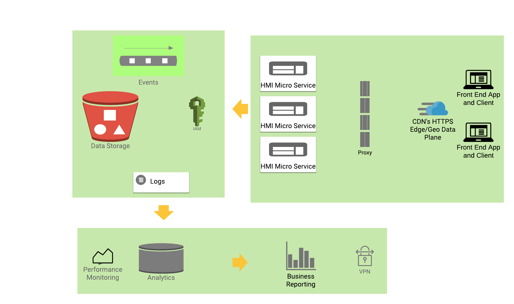
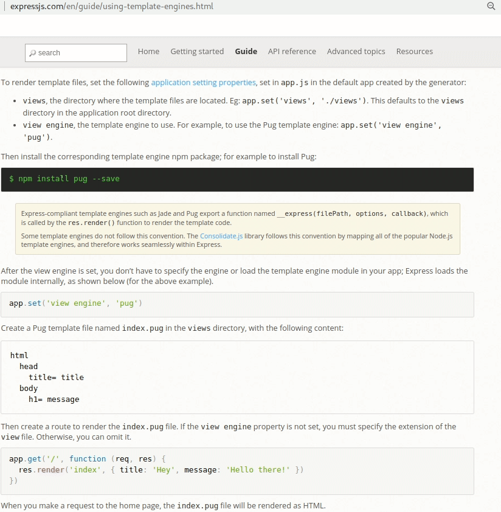

# Java ecosystem's 10 New Best Practices for the 2020s 
#### (title continued...) for back end / data engineering, relative to Java from 2000s and 2010s.
by Vic Cekvenich

Summary: There are some radical differences in today's Java ecosystem relative to the prior decade. The listed difference add up to a difference in kind, not a difference in degree. We have achieved an order of magnitude improvement with the following new adjustments in our development. The list has 10 points over 4 pages, including code examples.

Note, if you find typos or issues in this draft, please contact me, I have limited time to do open source. Also, if you click on the right, you should be able to see the TOC.

## #1. Scala, Kotlin, Groovy
SDKMan, Scala, and Java 11 are incremental improvements for the 2020's Java ecosystem.

Kotlin is the default JVM language used for Google's Andorid platform. Scala is popular for Data Science. And Groovy is dynamic, like NodeJS and Python - that are now more popular than java.
All 3 are more concise than Java for writing applications. Of the 3 Scala seems easiest to adopt; you can  go to a webpage online and paste Java code and it will be converted to Scala. 

But, when writing a library, it is better to write it in Java, so it can be used by all other languages on the JVM platform. So the core code would be Java, but developent or the application should be Scala, Groovy or Kotlin. You should be polyglot in any case.

Today we install Java 11 LTS via SDKMan, and simply run the app via, usually inside a shell command:

```
	java -jar myApp.jar
``` 

Oh, an why be JVM based? Because JVM is better then C++, the closest alternative. (One example of why C++ is bad is that a trillion dollar F35 plane is a failure, and it was written in C++. I find C++ a risk to the delivery of a project)

## #2: Cloud, eg.: S3

There is still a lot of organizations that have not moved to the the cloud. The base cloud service is S3 (aka Object Store or Hadoop). 
S3 providers include AWS, GAE, but also Linode, Wasabi, Vultr, etc. Storing data is very cheap, almost free, so storing PetaBytes and more is now common. Here is an example of writing 3 million rows of data to Vultr's S3 from Scala (using the Java helper classes):

```
    val s3: BasicS3Util = new BasicS3Util(server, access, secret, bucket)
    new LoadS3().load(s3)

```
And that calls this class:

```
  def load(s3: BasicS3Util): Unit = {
    new SNX().getSNX
    _s3 = s3
    ins() // each ins() is a million, so 3 million rows inserted
    ins()
    ins()
   }//()

   def ins(): Unit = {
    // 25*40* 1000 = 1 Million rows inserted
    val mCount: Int = 25
    var i: Int = 0
    while (i <= mCount) {
      val t: TimerU = TimerU.start()
      _insBatch(40 * 1000)
      i = i + 1
      println(" in " + t.time())
    }
  }//()

  def _insBatch(count: Int): Unit = {
    var i: Int = 0
    val lst: java.util.List[java.util.Map[String, Object]] = new ArrayList()
    while (i <= count) {
      val row: java.util.Map[String, Object] = new HashMap()
      row.put("name", _faker.name.nameWithMiddle())
      row.put("ip",   _faker.internet.ipV4Address().toString)
      row.put("cc",   _faker.business.creditCardType())
      row.put("dept", _faker.commerce.department())
      row.put("price",_faker.commerce.price())
      lst.add(row) 
      i = i + 1
    }
    _s3.put(prefix, lst)
  }//()

```
The helper functions convert the java.util.List of rows into an InputStream, because S3 is implemented as a Hadoop file system. Once stored, we can later search our lists via 'path'.

There are many cloud service in addition to S3, to many to list. Some example I like include ELK in the cloud by https://logz.io/platform, SigmaComputing for DataViz, PubNub Inc. for ESB, and AWS Amplify for Auth. Everyday there are more ways to leverage the cloud to improve capabilities, increase business flexibility and reduce costs. 


## #3: DB in RAM Memory

DB's using RAM is a new and revolutionary improvement.
Our new RAM friends include Aerospkie, Spark, Clickhouse, Apache Ignite and Arrow, etc. 

Our old friend REDIS works well, as does SQLite. 
Before the 2020's a Databases (SQL, Object, FTS, Graph, etc.) would be stored on an SSD, NVMe, M2/U2, etc. 
But now cloud providers have machines that have 512 Gigs of RAM and more, and even terabytes of RAM is available. And RAM is much faster than any type of SSDs. Plus I don't have to worry about the slow I/O performance in the cloud.
And if terabytes is too small for your RAM DB: You can cluster you DB cloud containers and combine several DB servers into any size you need, with a bit engineering, or by using an of-the-self solution. AWS has specialized big memory containers available that you could leverage. 


In addition to DB clusters, it is now common for the RAM DB to also be local in your application's container. A 'fat memory' container w/ 512Gig , that reduces network latency, adapting the Spark architecture. Your cloud VM's should be 512 Gig or RAM or more. And if you don't properly configure your cloud containers you will end up overpaying for your cloud. I think we all know  how much profit AWS generates for Amazon. Don't be the organization that facilitates their margins.


#### Note: Even in a 'fat memory' container you want to configure as a micro-service, to enable independently scaled  load.

This is a a paradigm shift, and requires learning and internalizing.  I recommend that your local development machine should also have 128Gig of RAM or more so you get a fell for the approach. Some development workstation with 128Gig plus of RAM are iMac Pro, System 76 and Digital Tigers.

##### Aside: Lots of people use a term Big Data. It is not Big Data if it fits on my $800 laptop with 2TB SSD Driver. There is no need to cluster data that are in terabytes, it fits in on a single box! I recommend a new term: small data, when you could fit it in a single consumer-level laptop.

### Spark-like Data Engineering

Spark is very popular. I'm going to oversimplify Spark: it lets you take unstructured data from data lakes such as S3, then execute memory SQL and statistical operations (via a Spark/K8 clusters) and report on the data by using charts and graphs. 

A custom Spark solution will be much faster. We can read columns from S3 into a SQLite temp table in RAM, and then use the Java Poi library to save to a spreadsheet. From a spreadsheet 
it is a few clicks to make a chart or a graph. For other needs, clustering SQLite wrapped in a Java service does not take much effort. 
In any case, SQLite can be completely in RAM, or can have temp tables in RAM for materialized views - and SQLite can provide the magic to amaze your users.

Plus, Data Engineers use CSV, but using SQLite DB file is a big improvement when sharing. 


### Demo Example 1: 

Here is an example project folder that includes items we mentioned so far. It is a simple Scala project that uses a Java lib (in the lib folder, but deployed )
 that measures how many records we can read from S3 and insert into SQLite per second. You can change the code to have SQLite built-in feature to use RAM DB instead of disk. It leverages a few helper classes that I added to the SNX lib.

- https://github.com/intuition-dev/SNX/tree/master/SNX_01db


## #4: Tools: Gradle.build, Jitpack, Jitpack CI/CD, Cloud IDE.

Before the '20's, we used to use POM.xml, in ...XML. The improvement is self evident with gradle.build.

Compare the power, here is a build.gradle that publishes a jar to Jitpack, so you can use the jar in their apps via gradle (or users who still use the antiquated maven). Once published, you can now use your jar anywhere in the JVM ecosystem. It is self evident how  much easier the Jitpack is compared to what we had to deal with publishing a jar with XML to Maven. It is just as easy to publish a jar, as it is to publish npm from the NodeJS ecosystem.  Also, Jitpack offers CI/CD. 
Also a big win is that it is less likely that you will break the build, as everything, including IDE's revolves around the gradle.build.

```
buildscript {
  repositories {
    maven { url "https://jitpack.io" }
  }
  dependencies {
    classpath 'com.github.jengelman.gradle.plugins:shadow:5.2.0'
  }
}
plugins { id 'com.github.johnrengelman.shadow' version '5.2.0' }

apply plugin: 'com.github.johnrengelman.shadow'
repositories {
	maven { url 'https://jitpack.io' }
    mavenCentral()
}
dependencies { }
archivesBaseName = 'XXX'
shadowJar {
   baseName = 'XXX'
   classifier = '' archiveVersion = ''
}
tasks.build.dependsOn tasks.shadowJar
artifacts { archives shadowJar }
// needs jitpack.yaml in root for java version and gradle for its version
group = 'com.github.jitpack'

```

##### No XML. The entire code base backing this article is not using any XML. I have seem that XML can be a replant for good programmers, they move to other platforms. Rod Johnson, creator of Spring-Boot has encouraged migration away form XML with some public hints.

And, before the '20s we started deploying to cloud. But now even our IDE can be in the cloud as well, check out CodeAnywhere for you development environment.


## #5: JAR for Services/'REST', with Reactive Streams

#### A quick history review: 
In ancient times, Java devs would use containers such as Tomcat via WAR files that contained WEB-INF/libs and such. Then it eveloved into Webapps using Trustin Lee's Netty project - used by Twiter, Akka, and more. Netty was an async (NIO) network library, just a jar and did no need for WAR or containers, making it easier to work with.

And in 2010's Reactive programming became popular (I won't explain here what Reactive is, it would take more space, but most of the explanation on WWW are ... poor) and Reactive Streams were added to Java 9 by Doug Lea. In 2020's. by Oleg Kalnichevski's Apache http core is a Java library like Netty, but can leverages the Java 9 reactive streams. So we'll use that!

### Demo Example 2: 

Here is an example Scala project folder that uses Apache http core library v5 that emits a simple 'REST' GET JSON response. It also acts as a simple HTTP Server, so you can write an index.html that uses **fetch()** (we don't use Ajax anymore) to GET that JSON. The example is synchronous, but the library used supports reactive streams. 

- https://github.com/intuition-dev/SNX/tree/master/SNX_02web


## #6: Stress/Load testing

Java now comes with a built in HTTP Client. In the past we might have setup jMeter or Grinder for stress testing, but now writing a stress test script the uses the built in Java HTTP Client wrapped in Java Executor thread pool makes it just as easy to script GETs and POSTs. A simplistic example that you would run in Java Executor thread pool:

```
	public String GET(String uri) throws Exception {
		HttpClient client = HttpClient.newHttpClient();
		HttpRequest request = HttpRequest.newBuilder().uri(URI.create(uri)).build();

		HttpResponse<String> response = client.send(request, BodyHandlers.ofString());
		return response.body();
	}
```

There are a helper class in the lib I used that wraps this method in an executor to simulate appropriate stress/load. You need to write a CLI(app) Scala script to start the http services, and in another tread run the stress test, and then report the results. For example email the results. 
Stress/Load testing is **not optional**. It must be scripted into your CI process to catch any performance regressions. Github has hooks that can transparently call our little Apache http core lib and  email us the performance results as well as use the Jitpack API as needed.

### Next: JAMstack.org

Next few points will touch on something called JAMstack, simplistically it is an  API way of working with (generated) front end, including SPA.

## #7: Client side API, Client side ViewModel

Today from a browser we write **fetch()** instead of Ajax calls. A question: Who should write that fetch() command that runs in the browser on the client side? 

2020's the answer is: Back end engineer! The 'Java' guy that wrote the 'REST' service also writes the client side API to call that service. As well as documenting both approaches.

The APIs are done by the back end team going forward. Front end has to worry about UX, CSS design, CSS frameworks. And back end team supports them. Those API calls fetch() commands are writen in a ViewModel class (JavaScript/TypeScript support classes that can transpile to ES5/IE11 via tools like PrePros.io and such). You, my back end friend, write a ViewModel per page/screen, just like before 2020's, when you wrote the ViewModel server side. Now you do it **client side**.

This is where a git 'uni repo' comes in, the ViewModel is tied to the View and the ViewModel API are tied to the server side services, and a uni repo makes sure that a release is synced! And the back end team has to follow the View changes and map to it. The front end developer just uses the ViewModel, and does not touch the internal fetch() code that does CRUD or state management. 
This way it is the back end developer that is responsible for data security, TLS and user authentication of each API call, it is their lib. We all found out that the front end developers can't do data security layer well. So back end team handles all the user authentication, access and data security. You can even do fancy things related to **topology aware client**, such as calling EU, USA or APAC back end as needed, timeouts, or even more tricks.  For example if you change the encoding, you don't bother the front end devs. They use the ViewModel and are not aware of the implementation. 

Of course, same goes for IOS(Swift)) and Andorid(Kotlin) apps. Back end/data engineering team  must be polyglot and write and support the ViewModel and API calls cross platform and document it. And still support the raw back end service.


Let me should you example code.
Here is the server code snippet using Apache http core that  emits a REST response to **/API1** and acts as a http server serving html files and assets:

```
  var _routes: Map[String, IRoute] = routes
  var _docRoot: String = docRoot

  def handle(req: ClassicHttpRequest, resp: ClassicHttpResponse, context: HttpContext) {
      // browser and CDN cache:
      resp.setHeader("Cache-Control", "public, max-age=" + 1 + ", s-max-age=" + 1)

      var PATH: String = getPath(req)
      // check if File in docRoot, else serve an SSR Route
      var file: File = new File(this._docRoot + PATH)
      if (file.exists() && !file.isDirectory()) {
        serveAFile(file, resp, context)
        return
      }

      // above is file, but now API route not found?
      if (!_routes.containsKey(PATH)) {
        var outgoingEntity: StringEntity = new StringEntity("no such resource " + PATH)
        err(resp, outgoingEntity)
        return
      }

	  //else we have an API route registered
      var r = _routes.get("/API1")
      var params = getParams(req)
      var ret = r.ret(params)
      var outgoingEntity = new StringEntity(ret)
      good(resp, outgoingEntity)

```

And here is .js file loaded in a browser that calls above service:

```
	class UserVM {
	   constructor(cb) {
		  fetch('http://localhost:8888/API1')
		  .then((response) => {
		    return response.json()
		  })
		  .then((myJson) => {
		   cb(myJson)
		  })
	   }
	}//class
```

Enjoy.  

## #8: Starter Enterprise Cloud Software Arcitecture 

In Chess, there are openings, such as Queens Gambit. There is an chess opening played that is played by advanced international grand masters informally called 'Gand Prix'. 


In the past you may put nginx in front of your REST services, but now we use Cloud to front the services. We not longer user https servers like ngix. Use a CDN! CDN provides https offloading, early TLS handshake, HTTP/3(udp based), etc.  Also it helps with security since the endpoint IP of the services is **not** exposed to the WWW. 

CDN also helps with Blue-Green deployments, and even gradual deployment, where you deploy to Canada or APAC first, and a day later to EU and Americas, once you know there are no stability issues with a new push.





## #9: Switch testing focus to: E2E testing

E2E is end to end testing. You can still do some unit testing as needed, for example for libraries. ( I would recommend avoiding XML. Even if you use IOC, there are pure Java IOC libs that avoid unchecked Strings in the middle). But E2E 100% test coverage is required, of the above mentioned ViewModel.

With E2E you automate the testing of the end point, in this case you test the ViewModel/API.  If the ViewModel works, then everything integrates and everything else must be working behind it! So in addition to stress/load testing of the server service, you must do ViewModel/API testing of browser ( Android and IOS). 


E2E is a radical difference and requires time to internalize. You should do the lab here that does a simple E2E test. 
E2E has 5 components: 

- 1) ViewModel/API javascript, one per each page/screen of the application. This is what is tested.
- 2) A running http service that provides 'REST' services to that View/Model API; and a running http file server that runs the html ages so we can server them. Usually it is one and the same, a single port used for API and http files.
In our case our lib will use Apache http core to do both, serve REST and serve html files.
- 3) QUnit(or similar) index.html page that in the browser tests the ViewModel/API .js CRUD methods. Your E2E tests are written in .js to run on client side. We can run this test manually by opening the test pages in a browser. Errors and success is reported to the calling .js function that starts the test.
- 4) Selenium Chormedriver (v4), in Java will open the test page, and call a .js function to start the 'QUnit' test. It will then report the test results, for example via email. So you will have a CLI Scala script that runs the http server and runs a Selenium in another thread that call to the .js testing function.
- 5) CI/CD server that is running at all times in the cloud, the deploys and runs the tests. It gets called by a dashboard or webhooks to do E2E, stress testing, staging deployments, etc. (eg: JitPack, Jenkins, etc.)

So those are the 5 parts for E2E test.

I will now show the Selenium code since this is classic code (and the full source code example code is available in this git project).
But I'll show you the QUnit javascript/typescript code on the client called by Selenium, that tests the ViewModel:

```
class TestVM1 {
   constructor () {
      depp.define({'vm1':'/api/UserVM.js'})
      depp.require(['vm1'], function(){

      QUnit.test( "hello tests", function( assert ) {
         TestVM1._done1 = assert.async()
         TestVM1._assert = assert
         console.log('in test:')
         new UserVM(function(json){
            console.log(json)
            _WDcb(json)
            TestVM1._assert.ok(true) //passed. Should check json, but...
            TestVM1._done1()
         })
      })//tests
      })//req
   }//()
}//class

// setup the webdrive callback
var _WDcb
function webDriverFoo(WDcb) {
   _WDcb = WDcb
   console.log('start tests')
   var pro = loadQunit()
   pro.then(function(){
      QUnit.config.autostart = false
   
      //QUnit.start()
      new TestVM1()
   })//pro
}

```

You should try to do this lab. It does have many parts, but once it is automated it becomes second nature. 

### Lab Example 2: 

So here is a Lab you should reivew, Selenium E2E calling fetch() API in a .js ViewModel, full code of what we talked about:

- https://github.com/intuition-dev/SNX/tree/master/SNX_03E2Etst


## #10 SSR (Server Side Rendering) with Pug

We used to use PHP, ASP, JSP for SSR, ~ 1/3 of WWW is PHP.
But here is what we use in NodeJS, something more modern:




And in Java/Scala we can do this:

```
   var _render: JadeConfiguration = new JadeConfiguration()

  def Pug(): String = {
    val cwd: String = System.getProperty("user.dir")
    val loader: TemplateLoader = new FileTemplateLoader(cwd + "/routes/", "UTF-8")
    _render.setTemplateLoader(loader)
    _render.setCaching(false)
    val template1: JadeTemplate = _render.getTemplate("index.pug")
    
    val model1: java.util.Map[String, Object] = new java.util.HashMap[String, Object]()
    model1.put("city", "Bremen")
    //binding
    val html: String = _render.renderTemplate(template1, model1)
    html
  }
```

Are you not impressed yet? OK, let me teach you Pug in 15 seconds:
- https://html2pug.now.sh
End of lesson.

2020's we use templating engines, for example eBay uses Marko and here is other examples on staticgen.com. Pug is a good template engine. When you need SSR, use Pug.


##### The End

----


## Review

The goal of the best practices is limited to what an average engineer can learn then in 1 day, and a Sr engineer can learn them in 1/2  a day.
It was influenced Spring-Boot, Spark and Akka

The major changes are that you must use 128gig to 8tb of RAM per node, you must do stress testing, and the ViewModel is now client side. But other changes also contribute to the significant improvement and ease of development. 

### Call for  help:

Are you an experienced Java tech leader?
If so:

- I listed some good particles. Is there another new modern practice missing?

- And is there anything I should remove or correct!
Reach out to me please and help me. vic(at) eml.cc

##### NOTE: If anyone would like to join this 2020 Java ecosystem best practices effort, please do that by contacting me at: vic (at) eml.cc .


## Bio

I am Vic Cekvenich, my claim to fame is writing the first book on Java Struts MVC, a predecessor to Spring. ( https://cekvenich.github.io/cekvenich/book.pdf ) I have been looking at Apache Spark, Akka, Spring boot, etc. and I think we can improve. There are even a few ideas we can leverage from NodeJS's Express library and JAMstack.org
Better, easier and faster. So lets review my list of 2020's Best Practice pillars for the Java ecosystem: 
